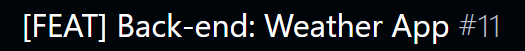
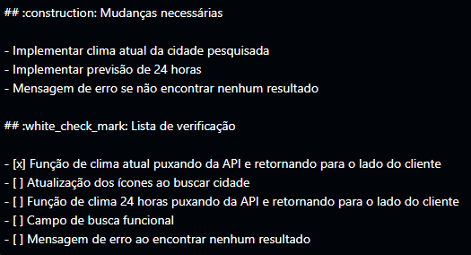
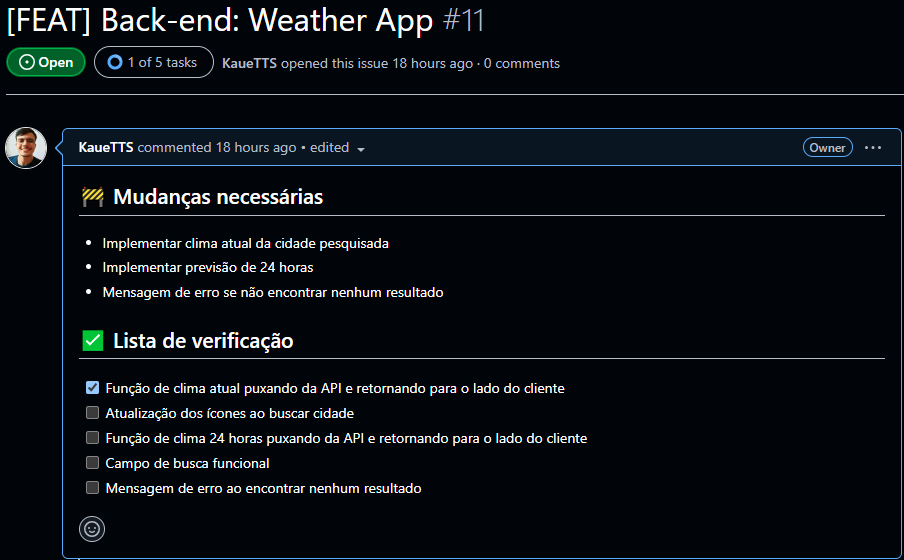
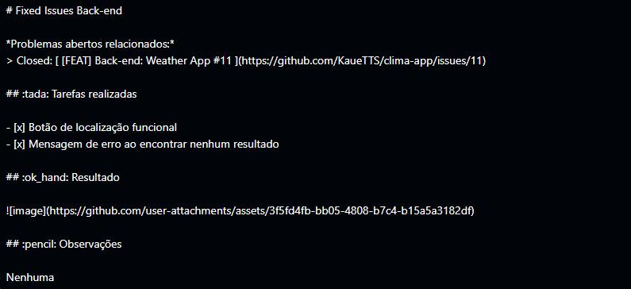
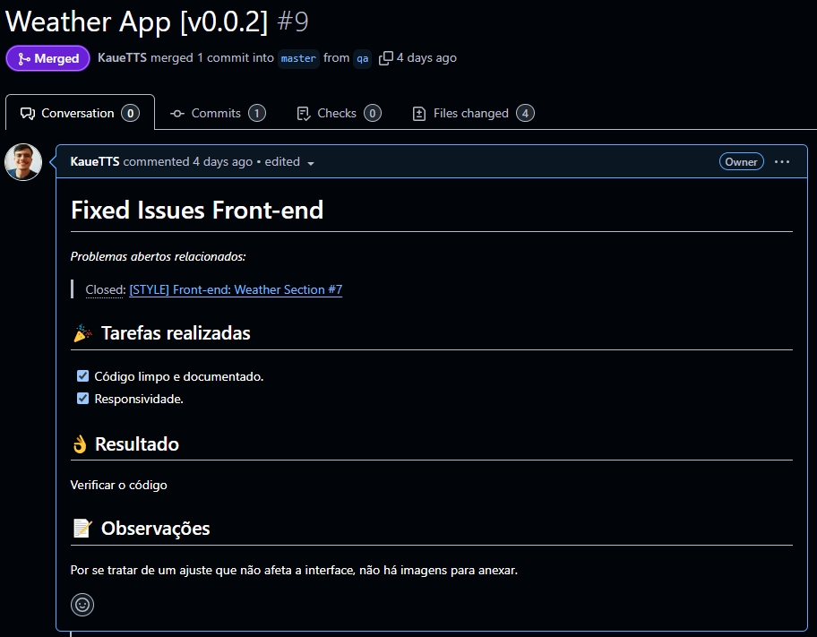
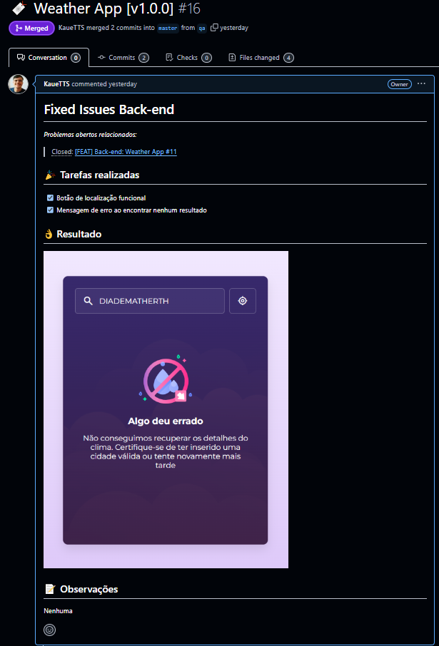

<h1 align="center">Padrões GitHub</h1>

### Tópicos

- [Commits](#commits)
  - [Tipos](#tipos)
  - [Padrões de emojis](#padrões-de-emojis)
  - [Principais comandos do Git](#principais-comandos-do-git)
- [Issues](#issues)
  - [Padrão de Issue nos projetos](#padrão-de-issue-nos-projetos)
- [Pull Request](#pull-request)
  - [Padrão de Pull Request nos projetos](#padrão-de-pull-request-nos-projetos)
- [Geral](#geral)
    - [Para saber mais sobre COMMITS](#para-saber-mais-sobre-commits)
    - [Para saber mais sobre ISSUES](#para-saber-mais-sobre-issues)
    - [Para saber mais sobre PULL REQUEST](#para-saber-mais-sobre-pull-request)

## Commits

Os commits no Git registram alterações no código, criando um histórico de versões. Cada commit inclui uma mensagem explicando a mudança, permitindo rastrear e entender o desenvolvimento do projeto.

### Tipos

- `feat`- Indicam que seu trecho de código está incluindo um **novo recurso**.

- `fix` - Indicam que seu trecho de código commitado está **solucionando um problema**.

- `docs` - Indicam que houveram **mudanças na documentação**, como por exemplo no Readme do seu repositório.

- `test` - São utilizados quando são realizadas **alterações em testes**, seja criando, alterando ou excluindo testes unitários.

- `build` - Commits do tipo build são utilizados quando são realizadas modificações em **arquivos de build e dependências**.

- `perf` - Servem para identificar quaisquer alterações de código que estejam relacionadas a **performance**.

- `style` - Indicam que houveram alterações referentes a **formatações de código**, semicolons, trailing spaces, lint e etc.

- `refactor` - Referem-se a mudanças devido a **refatorações que não alterem sua funcionalidade**, como por exemplo, uma alteração no formato como é processada determinada parte da tela, mas que manteve a mesma funcionalidade, ou melhorias de performance devido a um code review.

- `chore` - Indicam **atualizações de tarefas** de build, configurações de administrador, pacotes e etc. Como por exemplo, adicionar um pacote no gitignore.

- `ci` - Indicam mudanças relacionadas a **integração contínua**.

- `raw` - Indicam mudanças relacionadas a arquivos de configurações, dados, features, parâmetros.

- `cleanup` - São utilizados para remover código comentado, trechos desnecessários ou qualquer outra forma de limpeza do código-fonte, visando aprimorar sua legibilidade e manutenibilidade.

- `remove` - Indicam a exclusão de arquivos, diretórios ou funcionalidades obsoletas ou não utilizadas, reduzindo o tamanho e a complexidade do projeto e mantendo-o mais organizado.

### Padrões de emojis

<table>
  <thead>
    <tr>
      <th>Tipo do commit</th>
      <th>Emoji</th>
      <th>Palavra-chave</th>
    </tr>
  </thead>
 <tbody>
    <tr>
      <td>Acessibilidade</td>
      <td>♿ <code>:wheelchair:</code></td>
      <td></td>
    </tr>
    <tr>
      <td>Adicionando um teste</td>
      <td>✅ <code>:white_check_mark:</code></td>
      <td><code>test</code></td>
    </tr>
    <tr>
      <td>Atualizando a versão de um submódulo</td>
      <td>⬆️ <code>:arrow_up:</code></td>
      <td></td>
    </tr>
    <tr>
      <td>Retrocedendo a versão de um submódulo</td>
      <td>⬇️ <code>:arrow_down:</code></td>
      <td></td>
    </tr>
    <tr>
      <td>Adicionando uma dependência</td>
      <td>➕ <code>:heavy_plus_sign:</code></td>
      <td><code>build</code></td>
    </tr>
    <tr>
      <td>Alterações de revisão de código</td>
      <td>👌 <code>:ok_hand:</code></td>
      <td><code>style</code></td>
    </tr>
    <tr>
      <td>Animações e transições</td>
      <td>💫 <code>:dizzy:</code></td>
      <td></td>
    </tr>
    <tr>
      <td>Bugfix</td>
      <td>🐛 <code>:bug:</code></td>
      <td><code>fix</code></td>
    </tr>
    <tr>
      <td>Comentários</td>
      <td>💡 <code>:bulb:</code></td>
      <td><code>docs</code></td>
    </tr>
    <tr>
      <td>Commit inicial</td>
      <td>🎉 <code>:tada:</code></td>
      <td><code>init</code></td>
    </tr>
    <tr>
      <td>Configuração</td>
      <td>🔧 <code>:wrench:</code></td>
      <td><code>chore</code></td>
    </tr>
    <tr>
      <td>Deploy</td>
      <td>🚀 <code>:rocket:</code></td>
      <td></td>
    </tr>
    <tr>
      <td>Documentação</td>
      <td>📚 <code>:books:</code></td>
      <td><code>docs</code></td>
    </tr>
    <tr>
      <td>Em progresso</td>
      <td>🚧 <code>:construction:</code></td>
      <td></td>
    </tr>
    <tr>
      <td>Estilização de interface</td>
      <td>💄 <code>:lipstick:</code></td>
      <td><code>feat</code></td>
    </tr>
    <tr>
      <td>Infraestrutura</td>
      <td>🧱 <code>:bricks:</code></td>
      <td><code>ci</code></td>
    </tr>
    <tr>
      <td>Lista de ideias (tasks)</td>
      <td>🔜 <code> :soon: </code></td>
      <td></td>
    </tr>
    <tr>
      <td>Mover/Renomear</td>
      <td>🚚 <code>:truck:</code></td>
      <td><code>chore</code></td>
    </tr>
    <tr>
      <td>Novo recurso</td>
      <td>✨ <code>:sparkles:</code></td>
      <td><code>feat</code></td>
    </tr>
    <tr>
      <td>Package.json em JS</td>
      <td>📦 <code>:package:</code></td>
      <td><code>build</code></td>
    </tr>
    <tr>
      <td>Performance</td>
      <td>⚡ <code>:zap:</code></td>
      <td><code>perf</code></td>
    </tr>
    <tr>
        <td>Refatoração</td>
        <td>♻️ <code>:recycle:</code></td>
        <td><code>refactor</code></td>
    </tr>
    <tr>
      <td>Limpeza de Código</td>
      <td>🧹 <code>:broom:</code></td>
      <td><code>cleanup</code></td>
    </tr>
    <tr>
      <td>Removendo um arquivo</td>
      <td>🗑️ <code>:wastebasket:</code></td>
      <td><code>remove</code></td>
    </tr>
    <tr>
      <td>Removendo uma dependência</td>
      <td>➖ <code>:heavy_minus_sign:</code></td>
      <td><code>build</code></td>
    </tr>
    <tr>
      <td>Responsividade</td>
      <td>📱 <code>:iphone:</code></td>
      <td></td>
    </tr>
    <tr>
      <td>Revertendo mudanças</td>
      <td>💥 <code>:boom:</code></td>
      <td><code>fix</code></td>
    </tr>
    <tr>
      <td>Segurança</td>
      <td>🔒️ <code>:lock:</code></td>
      <td></td>
    </tr>
    <tr>
      <td>SEO</td>
      <td>🔍️ <code>:mag:</code></td>
      <td></td>
    </tr>
    <tr>
      <td>Tag de versão</td>
      <td>🔖 <code>:bookmark:</code></td>
      <td></td>
    </tr>
    <tr>
      <td>Teste de aprovação</td>
      <td>✔️ <code>:heavy_check_mark:</code></td>
      <td><code>test</code></td>
    </tr>
    <tr>
      <td>Testes</td>
      <td>🧪 <code>:test_tube:</code></td>
      <td><code>test</code></td>
    </tr>
    <tr>
      <td>Texto</td>
      <td>📝 <code>:pencil:</code></td>
      <td></td>
    </tr>
    <tr>
      <td>Tipagem</td>
      <td>🏷️ <code>:label:</code></td>
      <td></td>
    </tr>
    <tr>
      <td>Tratamento de erros</td>
      <td>🥅 <code>:goal_net:</code></td>
      <td></td>
    </tr>
    <tr>
      <td>Dados</td>
      <td>🗃️ <code>:card_file_box:</code></td>
      <td><code>raw</code></td>
    </tr>
  </tbody>
</table>

### Principais comandos do Git

- `git init` - Inicializa um novo repositório Git no diretório atual.

- `git clone url-do-repositorio-no-github` - Clona um repositório remoto existente no GitHub para o seu ambiente local.

- `git pull origin main` - Atualiza a branch local main com as mudanças do repositório remoto origin.

- `git checkout -b minha-nova-branch` - Serve para criar uma nova branch e alternar para ela imediatamente.

- `git add .` - Adiciona todos os arquivos e alterações no diretório atual para a área de stage (caso queira adicionar apenas arquivos específicos, basta trocar o . pelo nome do arquivo).

- `git commit -m "mensagem do commit"` - Registra as alterações adicionadas na área de stage com uma mensagem descritiva sobre o que foi modificado.

- `git push origin qa` - Envia os commits para o repositório principal do origin, nesse caso é a branch "qa". 

## Issues

As issues no GitHub são usadas para gerenciar tarefas, bugs e sugestões em projetos. Permitem descrever problemas, atribuir responsáveis, usar etiquetas para categorizar e colaborar por meio de comentários. São essenciais para organizar e acompanhar o progresso no desenvolvimento.

  ### Padrão de Issue nos projetos

  |<h4 align="center">Título da tarefa criada</h4>                                                          |<h4 align="center">Descrição da tarefa criada</h4>                                                     |
  |---------------------------------------------------------------------------------------------------------|-------------------------------------------------------------------------------------------------------|
  |

                       |

 |
  |
Entre colchetes, colocar o tipo de tarefa para realização (FEAT, STYLE, FIX...)
    |
Nas mudanças necessárias sempre coloque os pontos importantes da issue
           |
  |
Depois dos colchetes, colocar aonde será feito a alteração (FRONT-END, BACK-END...)
|
Na lista de verificação coloque todas as tarefas que realizou ou vai realizar
    |
  |
Por fim, colocar onde será feitas as alterações (CURRENT WEAHTER, NO APP TODO...)
  |
---------------
                                                                  |

  |<h4 align="center">Resultado</h4>                                                                        |
  |---------------------------------------------------------------------------------------------------------|
  |

      |

## Pull Request

Os pull requests no GitHub são usados para propor alterações em um repositório. Permitem revisar, discutir e aprovar o código antes de integrá-lo ao projeto principal. Facilitam a colaboração e o controle de qualidade no desenvolvimento.

  ### Padrão de Pull Request nos projetos

  |<h4 align="center">Título da tarefa criada</h4>                                                 |<h4 align="center">Descrição da tarefa criada</h4>                                                                           |
  |------------------------------------------------------------------------------------------------|-----------------------------------------------------------------------------------------------------------------------------|
  |

                  |

                                                |
  |
Colocar o nome do projeto logo após o ícone 🔖
                           |
Em fixed coloque o tipo de issue que tá atendendo (back, front, api ou outro)
                          |
  |
Depois colocar a versão que vai subir para a master ([v1.0.5], [v1.5.3])
  |
Abaixo, sempre coloque "issues: tarefa_da_issue", apenas coloque "closed" quando for concluir a tarefas
|
  |
---------------
                                                           |
Em tarefas realizadas, coloque o que foi feito da Issue (se não existir nenhuma issue sobre, crie)
     |
  |
---------------
                                                           |
Em resultado, coloque o que mudou da interface
                                                         |
  |
---------------
                                                           |
Se houver mudança apenas no código, coloque "Verificar o código" que nem no exemplo do resultado abaixo
|

  |<h4 align="center">Resultado com alteração só no código</h4>                                             |<h4 align="center">Resultado com alteração na interface</h4>                                             |
  |---------------------------------------------------------------------------------------------------------|---------------------------------------------------------------------------------------------------------|
  |

        |

            |

## Geral

Criar um projeto de qualidade envolve boas práticas de desenvolvimento, organização, e atenção aos detalhes. Aqui estão os principais pilares:

1. **Estruturação e Organização**
> ***Pastas e arquivos organizados:*** Separe componentes, serviços, estilos e configurações em diretórios específicos.  
> ***Nomes significativos:*** Dê nomes intuitivos a variáveis, funções e arquivos, refletindo suas responsabilidades.  

2. **Código Limpo e Legível**
> ***Princípios do Clean Code:*** Evite duplicação, mantenha funções pequenas e responsabilidades claras.  
> ***Comentários relevantes:*** Explique lógica complexa ou decisões não triviais, mas evite comentar o óbvio.  
> ***Formatação consistente:*** Use ferramentas como Prettier ou ESLint para manter o código padronizado.  

3. **Boas Práticas de Desenvolvimento**
> ***Controle de versão:*** Utilize Git com commits frequentes e mensagens descritivas.  
> ***Documentação:*** Crie um README detalhado e, se necessário, documentação técnica com instruções de uso e arquitetura.  
> ***Testes:*** Inclua testes unitários e funcionais para garantir confiabilidade.  

4. **Manutenibilidade**
> ***Dependências atualizadas:*** Atualize bibliotecas e frameworks regularmente para evitar problemas de segurança.  
> ***Gestão de erros:*** Crie mensagens de erro úteis e evite expor informações sensíveis.  

5. **Experiência do Usuário**
> ***Interface intuitiva:*** Mantenha o design simples, responsivo e funcional.  
> ***Feedback ao usuário:*** Notificações ou mensagens para ações concluídas ou erros encontrados.  

#### Para saber mais sobre COMMITS
- Acesse: https://docs.github.com/pt/pull-requests/committing-changes-to-your-project/creating-and-editing-commits/about-commits  
- Acesse: https://github.com/iuricode/padroes-de-commits/blob/main/README.md

#### Para saber mais sobre ISSUES
- Acesse: https://docs.github.com/pt/issues/tracking-your-work-with-issues/about-issues

#### Para saber mais sobre PULL REQUEST
- Acesse: https://docs.github.com/pt/pull-requests/collaborating-with-pull-requests/proposing-changes-to-your-work-with-pull-requests/about-pull-requests